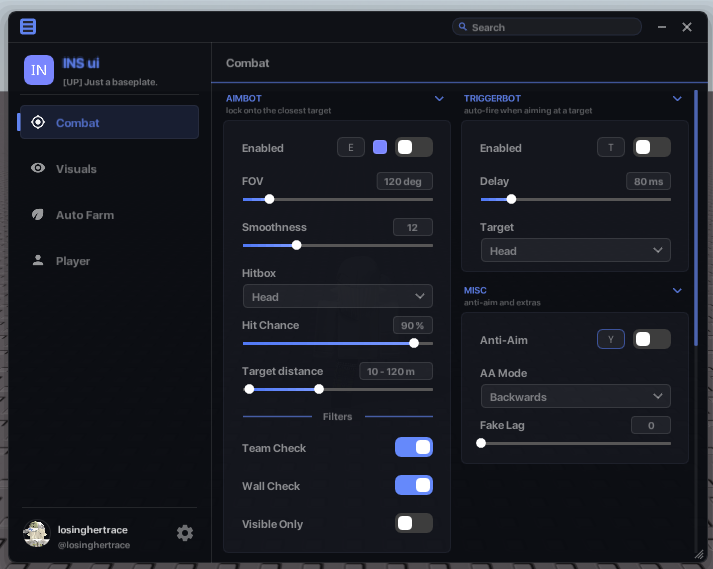

# INS ui



A Drawing-based UI library for Matcha. You describe the menu and the library draws it and handles all the input. Your logic lives in callbacks.

```lua
local Lib = loadstring(game:HttpGet("https://raw.githubusercontent.com/neaxusxgod-png/INS-ui/main/uilib.min.lua"))() or INSui
```

One line, works anywhere — top-level scripts and inside hubs alike. The `or INSui` is there because Matcha discards a chunk's return value, so the library publishes itself as the global `INSui` and the `or` reads that. (Don't expect a bare `local Lib = loadstring(...)()` to return it — read the `INSui` global, which the `or` does.) Load **`uilib.min.lua`** — the minified build (smaller, faster, less likely to truncate over HttpGet). **`uilib.lua`** is the same library, un-minified, if you want to read or edit the source.

> **In a hub?** The same one line works — `INSui` is a global, so it's readable even from a hub that's itself started with `loadstring(game:HttpGet(...))()`. The only thing that won't work is grabbing the library from the `loadstring` **return** (Matcha drops chunk return values) — so always read the `INSui` global, which the `or INSui` above does for you.

---

## Quick start

```lua
local Lib = loadstring(game:HttpGet("https://raw.githubusercontent.com/neaxusxgod-png/INS-ui/main/uilib.min.lua"))() or INSui

local win = Lib:CreateWindow({ title = "My Hub", size = Vector2.new(700, 540) })

local tab = win:Tab("Combat", "swords")
local sec = tab:Section("Aimbot", "Left")

sec:Toggle("Enabled", false, function(on)
    getgenv().Aimbot = on
end):AddKeybind("e", "Hold")

sec:Slider("FOV", 120, 1, 10, 500, "px", function(v)
    getgenv().Fov = v
end)
```

Press **P** to open or close the menu. A window holds tabs, a tab holds sections, a section holds widgets, and every widget has a callback that fires when its value changes.

---

## The window

```lua
local win = Lib:CreateWindow({
    title       = "INS ui",
    subtitle    = "v1",                   -- under the title; or "auto" to use the game's name
    size        = Vector2.new(700, 540),
    menuKey     = "p",                    -- open/close key, default "p"
    configName  = "myhub",                -- default config name
    configFolder= "myhub",                -- override the auto config-folder name
    position    = Vector2.new(40, 40),    -- optional start position, defaults to centred
    theme       = { accentA = Color3.fromRGB(255,120,160) },  -- optional initial theme
    logo        = "https://.../logo.png", -- header logo (url, path, or raw PNG/JPG bytes)
    icon        = "https://.../icon.png", -- corner gem + minimized-bubble icon
    opacity     = 0.95,                   -- 0.4..1 (or a percent like 95)
    rounding    = 1,                      -- corner-radius scale, 0..2.5
    rowLines    = true,                   -- thin separators between rows
    smartFps    = true,                   -- throttle redraws when idle
    gameInput   = false,                  -- true / false / "always": let input reach the game
    autoSave    = true,                   -- auto-save the config as you change things
    startOpen   = true,                   -- open immediately (default true)
})
```

You add tabs to `win`. It also has a ready-made Settings tab:

```lua
win:AddSettingsTab("cog")    -- themes, fonts, configs, performance
```

You can drop **your own** controls into that Settings tab — a separate card with your cheat's settings:

```lua
local mine = win:SettingsSection("My Cheat", "Right")   -- adds a card into the Settings tab
mine:Toggle("Streamer mode", false, function(on) end)
mine:Slider("UI scale", 100, 5, 50, 150, "%", function(v) end)
-- win:GetSettingsTab() returns the Settings tab itself, so you can add more sections/tabs to it
```

### More window methods

All callable on `win` or `Lib`:

```lua
Lib:SetOpacity(0.9)         -- 0.4..1, or a percent
Lib:SetRounding(1.5)        -- corner-radius scale 0..2.5  (Lib:GetRounding() reads it)
Lib:SetRowLines(true)       -- row separators on/off
Lib:SetPerformance(true)    -- performance mode (Lib:IsPerformance() reads it)
Lib:SetAutoSave(true)       -- auto-save the config on change
Lib:SetGameInput("always")  -- true / false / "always": let clicks reach the game
Lib:SetPosition(40, 40)     -- alias of SetPos
Lib:OpenSettings()          -- jump to the Settings tab
Lib:OpenSpotlight()         -- open the search palette
```

---

## Window controls

Callable on `win` or `Lib`, they are the same object. Useful for your own keybinds or a close button.

```lua
win:SetOpen(false)      -- open or close from code
win:IsOpen()            -- true / false
win:SetSize(800, 560)   -- resize, width and height are numbers (not a Vector2)
win:SetPos(40, 40)      -- move to x, y
win:Center()            -- re-centre on screen
win:SetTitle("New name")
win:SetMenuKey("rightshift")
win:Destroy()           -- remove the menu (alias win:Unload())
```

---

## Tabs and sections

```lua
local tab   = win:Tab("Visuals", "eye")        -- name, icon
local left  = tab:Section("Player ESP", "Left", "see players through walls")  -- 3rd arg = info-text
local right = tab:Section("World", "Right")
local full  = tab:Section("Notes", "Full")     -- "Full" spans both columns
```

Sections stack down two columns, `"Left"` or `"Right"`, and `"Full"` spans both. The optional **third argument** to `Section` is a short info-text line drawn in grey under the title — and `sec:Info("...")` adds a full word-wrapped info block among the widgets. Click a section header to fold it down to just the title and back. A chevron shows the state.

The default `side` layout keeps the left rail as a strip of icons that expands to show the tab names on hover (it stays open in Performance mode). Switch the tabs to the top with `Lib:SetLayout("top")`.

Icons are short names. Pass `nil` for none.

```
target crosshair swords user eye monitor palette settings cog sliders shield folder code zap
box home star skull gauge wrench bell lock search flame snowflake bot ghost gamepad brain map
rocket swirl
```

---

## Widgets

Every widget goes in a section. Most take a label, a default, and a callback that runs on change. They all return a handle you can chain onto (see [Handles](#handles)).

### Toggle

```lua
sec:Toggle("God Mode", false, function(on)
    -- on is true / false
end)
```

`Checkbox` is an alias — `sec:Checkbox("God Mode", false, fn)` is identical.

### Slider

`Slider(label, default, step, min, max, suffix, callback)`

```lua
sec:Slider("Walk Speed", 16, 1, 16, 250, "", function(v)
    -- v is the number
end)

sec:Slider("FOV", 120, 1, 10, 500, "deg", function(v) end)
```

Click the value to type an exact number. Right-click the bar to reset.

### Range slider

`RangeSlider(label, defLo, defHi, step, min, max, suffix, callback)`, a dual-handle min/max slider. The callback gets `(lo, hi)`.

```lua
sec:RangeSlider("Distance range", 25, 75, 1, 0, 100, "m", function(lo, hi)
    -- lo <= hi, both numbers
end)
```

Drag either handle (it grabs the nearer one), the two clamp around each other, right-click resets.

### Dropdown

`Dropdown(label, default, options, multi, callback, tooltip, searchable, maxSelections)`

```lua
-- single choice
sec:Dropdown("Mode", {"Closest"}, {"Closest", "Strongest", "Random"}, false, function(v)
    print(v[1])              -- the value is always a list, v[1] is the choice
end)

-- multi-select and searchable (type to filter, right-click for Select All / Clear)
sec:Dropdown("Hitbox", {"Head"}, {"Head", "Torso", "Neck", "Stomach"}, true, function(v)
    -- v is everything selected
end, nil, true)

-- cap a multi-select to N picks with the 8th arg
sec:Dropdown("Targets", {}, {"Mobs","Bosses","Players","Chests"}, true, function(v) end, "pick up to 2", true, 2)
```

Long lists get a draggable scrollbar (the mouse wheel is unreliable under Matcha, so drag is the dependable path). Change the options live:

```lua
local d = sec:Dropdown("Players", {}, {}, true, function(v) end, nil, true)
d:UpdateChoices(getPlayerNames())     -- swap the whole list
d:AddChoice("Steve")
d:RemoveChoice("Steve")               -- also deselects it
d:ClearChoices()
d:SetSearchable(true)
d:SetMaxSelections(3)
```

### Colorpicker

`Colorpicker(label, defaultColor, callback, defaultAlpha)`, callback gets `(color, alpha)`.

```lua
sec:Colorpicker("ESP Color", Color3.fromRGB(122, 134, 255), function(c, a)
    -- c is a Color3, a is 0..1 alpha
end, 0.5)   -- defaultAlpha is optional, defaults to 1
```

SV square, hue and alpha bars, and a hex box that takes `#RRGGBB` or `#RRGGBBAA`.

### Textbox

```lua
sec:Textbox("Webhook URL", "", function(text)
    -- text updates as they type
end)
```

Full editing: click to place the cursor, drag to select, Ctrl+A/C/X/V, arrows, Home/End.

### Keybind (standalone)

```lua
sec:Keybind("Panic key", "k", function(key)
    -- fired when they pick a new key
end)
```

For a keybind attached to a toggle, use `:AddKeybind` on the toggle (below).

### Button, Label, Divider, Image

```lua
sec:Button("Rejoin", function() rejoin() end)
sec:Label("Status: idle")                        -- pass a function for a value that updates live
sec:Info("Longer help text that word-wraps\nacross lines, dimmed.")   -- muted multi-line info block
sec:Divider("Advanced")
sec:Image(pngBytes, 80)        -- raw PNG/JPG bytes, height (optional 3rd arg = width)
sec:Button("Save", onSave):AddButton("Load", onLoad)   -- extra buttons on the same row
```

---

## Handles

Widgets return a handle, so you can keep building on them.

```lua
local aim = sec:Toggle("Aimbot", false, function(on) end)
aim:AddKeybind("e", "Hold")                                                  -- keybind on the toggle
aim:AddColorpicker("FOV", Color3.fromRGB(120,255,140), function(c,a) end)    -- extra colorpicker
aim:SetRisk()                                                                -- paint it as a risky option

local wall = sec:Toggle("Wall Check", true)
sec:Toggle("Visible Only", false):DependsOn(wall)                            -- greyed out unless wall is on
```

Methods on any handle:

```lua
h:Set(value)            -- set the value (fires the callback)
h:Get()                 -- read it
h:IsActivated()         -- is it active right now? (a keybind toggle that's on, or a standalone Keybind whose key is held)
h:Reset()               -- back to default
h:SetText("New")        -- change the label
h:Tooltip("info")       -- hover tooltip
h:SetColor(color)       -- tint the text
h:SetRisk(true)         -- mark as risky (no arg = on)
```

### Keybind modes

`AddKeybind(key, mode, callback)`, where mode is one of:

- `"Hold"`, on while you hold the key
- `"Toggle"`, flips on each press
- `"Always"`, just stays on

The optional **`callback`** makes the keybind **separate** from the toggle: when you pass one, pressing the key fires `callback(state)` and **does NOT change the toggle** — the key becomes its own hotkey. `state` (`true`/`false`) follows the mode: held for `Hold`, flips each press for `Toggle`, always `true` for `Always`. Without a callback the key drives the toggle as before. Poll it with `h:IsActivated()`.

```lua
sec:Toggle("Fly", false):AddKeybind("g", "Toggle", function(on)
    Lib:Notify("Fly", on and "on" or "off", 1)
end)
```

Left-click the keybind chip to rebind, right-click it to switch the mode.

Poll a bind's state from your own loop with `h:IsActivated()` (or `h.keyHandle:IsActivated()`): true while a `Hold` key is down, while a `Toggle` bind is on, and always for `Always`. A standalone `:Keybind` returns true while its key is held, so you can use one as a poll-able hotkey.

```lua
local fly = sec:Toggle("Fly", false):AddKeybind("f", "Hold")
-- in your loop:
if fly:IsActivated() then doFly() end
```

---

## Reading values without callbacks

To poll instead of using callbacks, address any widget by `Tab.Section.Label`:

```lua
if Lib:GetValue("Combat.Aimbot.Enabled") then Lib:Notify("aimbot", "is on", 2) end
Lib:SetValue("Combat.Aimbot.FOV", 90)
```

---

## Notifications

```lua
Lib:Notify("Aimbot", "enabled", 3)                 -- title, text, seconds
Lib:Notify("Saved", "config written", 3, "success") -- 4th arg = type
```

The optional type colours the dot, title and progress bar: `"success"` (green), `"warning"` (amber), `"error"` (red), `"info"` (accent, the default).

---

## Confirm dialog

A centered modal for anything destructive. It dims the screen, blocks the menu, and runs your callback on the choice. Esc or a click outside cancels.

```lua
Lib:Dialog({
    title   = "Unload?",
    text    = "Remove the menu?",
    confirm = "Unload",        -- optional, default "Confirm"
    cancel  = "Cancel",        -- optional, default "Cancel"
    onConfirm = function() Lib:Destroy() end,
    onCancel  = function() end,  -- optional
})
```

---

## Floating boxes

A free-floating, draggable panel, good for a small HUD or readout.

```lua
local box = Lib:CreateBox({ title = "Stats", position = Vector2.new(20, 140), width = 200 })

box:Text("kills: 0")                       -- a plain line
local hp = box:Stat("HP: 100")             -- a "label : value" style line
box:Bar(0.5)                               -- a 0..1 progress bar
local fps = box:Text(function() return "fps: " .. getFps() end)   -- a function = live line, re-read each frame

-- Text / Stat / Bar each return a line handle:
hp:Set("HP: 80"); hp:SetColor(Color3.fromRGB(250, 93, 86))

box:SetTitle("Session")
box:SetVisible(false)   -- or box:Toggle()
box:Clear()
box:Remove()
```

`box:Text` is also aliased as `box:Label`. Box options: `title`, `position` (or `x` / `y`), `width` (or `w`), `visible`.

---

## Theme, fonts, layout

```lua
Lib:ApplyThemePreset("Indigo")
Lib:SetTheme({ accentA = Color3.fromRGB(255,120,160), accentB = Color3.fromRGB(200,120,255) })
Lib:SetFont("Minecraft")
Lib:SetLayout("top")               -- "side" (collapsible left rail, default) or "top"
```

Accent presets:

```
Indigo Mono Sunset Mint Rose Gold Crimson Ocean Toxic Lavender Aqua Ember Cyber Bubblegum
Forest Slate Cherry Aurora Sky Magma Grape Steel Peach Neon Waifu
```

`Lib:ThemePresets()` returns the full list at runtime, sorted alphabetically. Waifu is green and also drops an image behind the menu. You can set your own background on any theme:

```lua
Lib:SetBackgroundImage("https://.../pic.png", 0.5)   -- second arg is opacity, nil clears it
```

### Background effects

Decorative particles behind the menu while it's open. Off by default. Set them in Settings, Appearance, Background FX, or from code:

```lua
Lib:SetBackgroundEffect("Snow")   -- "Snow", "Matrix", "Rain", or "Off" / nil
Lib:BackgroundEffects()           -- the list of names
Lib:SetBackgroundEffectColor(Color3.fromRGB(120, 200, 255))   -- recolour the particles (nil = each effect's own colour)
```

There's a matching "FX colour" picker in Settings, Appearance. The choice (and colour) save with the config, and the particle count halves in Performance mode.

Fonts (only the ones Matcha actually exposes will load):

```
Default Bold Proggy Minecraft JetBrains Pixel Fortnite
```

All of this is in the built-in Settings tab (`win:AddSettingsTab()`) too, so users can change it themselves: a Rainbow accent, Background and Text colour pickers, Card glow, Border and Frost sliders, Performance mode (60fps, no shadow, glow or animation, the rail stays open), menu opacity, search style, and the menu key. Everything saves with the config.

---

## Configs

```lua
Lib:SaveConfig("pvp")
Lib:LoadConfig("pvp")
Lib:ListConfigs()        -- { "pvp", "farm", ... }
Lib:DeleteConfig("pvp")

local code = Lib:ExportConfig()   -- one base64 string
Lib:ImportConfig(code)

win:autoloadConfig("pvp")  -- load a config immediately, defaults to the window's configName
```

A config captures everything: every widget value, keybinds, theme and accents, fonts, layout, and the Appearance and Performance settings. The Settings tab wires save and load to buttons, so you rarely call these by hand.

**Each script gets its own config folder automatically** so configs from different hubs never mix. The folder is derived from your window title (`title = "My Hub"` saves to `INSui_My Hub/`), or set your own with `CreateWindow{ configFolder = "myhub" }`. Scripts with no title fall back to the shared `INSui_configs/`.

To share a config, send the file. `SaveConfig("name")` writes `<your folder>/name.json` in the Matcha workspace folder. A friend drops it in the same folder and calls `LoadConfig("name")`. (The base64 `ExportConfig` / `ImportConfig` path needs `getclipboard`, which many Matcha builds don't expose, so the file is the reliable route.)

---

## Search

Press **Ctrl+Space** (or click the title-bar search) to open the command palette, type, and jump to any widget in any tab. It's fuzzy, so `wsp` finds Walk Speed, and it indexes every widget automatically.

The title-bar box can be a full Bar, just an Icon, or Off (Settings, Search). Ctrl+Space always works. From code: `Lib:OpenSpotlight()`, or `Lib:OpenSettings()` to jump straight to settings.

---

The **Quick start** above plus the widget reference cover the whole API — copy a block, swap in your callbacks, and you have a working menu.
