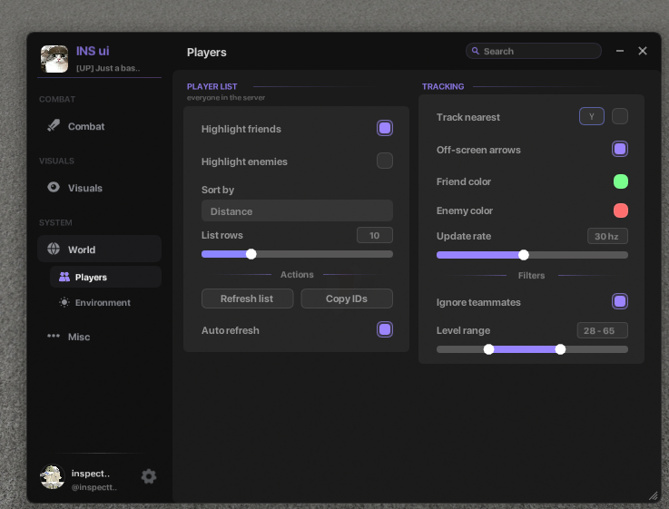

# INSUI



## Load

```lua
local Lib = loadstring(game:HttpGet("https://raw.githubusercontent.com/neaxusxgod-png/INS-ui/main/uilib.min.lua"))() or INSUI
```

## Start

```lua
local win = Lib:CreateWindow({ title = "My Hub", size = Vector2.new(700, 540) })

local tab = win:Tab("Combat", "crosshair")
local sec = tab:Section("Aimbot", "Left")

sec:Toggle("Enabled", false, function(on) end):AddKeybind("e", "Hold")
sec:Slider("FOV", 120, 1, 10, 500, "px", function(v) end)
```

P opens and closes the menu. Full file: [showcase.lua](showcase.lua)

## Window

```lua
Lib:CreateWindow({
    title       = "My Hub",
    subtitle    = "v1",                 -- or "auto" for the game name
    size        = Vector2.new(700, 540),
    position    = Vector2.new(40, 40),  -- default centred
    menuKey     = "p",
    theme       = { accent = Color3.fromRGB(255, 120, 160) },
    accentA     = Color3.fromRGB(122, 134, 255),
    accentB     = Color3.fromRGB(189, 130, 255),
    font        = "Proxima",
    logo        = "https://site.com/logo.png",
    logoSize    = 30,
    icon        = "https://site.com/icon.png",
    opacity     = 0.95,
    rounding    = 1,
    rowLines    = true,
    checkboxStyle = true,
    keybindOverlay = true,
    backgroundEffect = "Rain",
    backgroundEffectColor = Color3.fromRGB(160, 90, 255),
    configName  = "myhub",
    configFolder = "myhub",
    autoSave    = true,
    smartFps    = true,
    gameInput   = false,
    startOpen   = true,
})
```

`win:AddSettingsTab("cog")` adds the built in settings tab. `win:SettingsSection("Mine", "Right")` puts your own card in it.

Callable on `win` or `Lib`:

```lua
win:SetOpen(false)   win:IsOpen()      win:SetSize(800, 560)   win:SetPos(40, 40)
win:Center()         win:SetTitle("X") win:SetMenuKey("rightshift")
win:Destroy()        win:Unload()      win:autoloadConfig("pvp")
```

## Tabs and sections

```lua
Lib:Category("VISUALS")
local tab = win:Tab("Visuals", "eye")
local left = tab:Section("Player ESP", "Left", "see players through walls")
local full = tab:Section("Notes", "Full")

local world = win:Tab("World", "globe")
world:Sub("Players", "users"):Section("List", "Left"):Toggle("Names", true)
```

Sides are `Left`, `Right`, `Full`. Click a section header to fold it. `Lib:SetLayout("top")` moves the tabs to the top.

## Widgets

```lua
sec:Toggle("God mode", false, function(on) end)
sec:Slider("Walk speed", 16, 1, 16, 250, "", function(v) end)
sec:RangeSlider("Distance", 25, 75, 1, 0, 100, "m", function(lo, hi) end)
sec:Dropdown("Mode", {"Closest"}, {"Closest", "Random"}, false, function(v) end)
sec:Colorpicker("ESP color", Color3.fromRGB(122, 134, 255), function(c, a) end, 0.5)
sec:Textbox("Webhook", "", function(text) end)
sec:Keybind("Panic", "k", function(key) end)
sec:Button("Rejoin", function() end):AddButton("Hop", function() end)
sec:Label("Status: idle")
sec:Info("longer help text that wraps")
sec:Divider("Advanced")
sec:Image(pngBytes, 80)
```

`Checkbox` is the same as `Toggle`. Dropdowns take `multi`, `tooltip`, `searchable`, `maxSelections` as the 4th to 8th argument, and a function instead of a list to refresh themselves:

```lua
sec:Dropdown("Player", {}, function() return getNames() end, false, function(v) end)
```

## Handles

```lua
local aim = sec:Toggle("Aimbot", false, function(on) end)
aim:AddKeybind("e", "Hold", function(on) end)
aim:AddColorpicker("FOV color", Color3.fromRGB(120, 255, 140), function(c, a) end)
aim:SetRisk()

local wall = sec:Toggle("Wall check", true)
sec:Toggle("Visible only", false):DependsOn(wall)
```

```lua
h:Set(v)   h:Get()      h:Reset()      h:IsActivated()
h:SetText("New")        h:Tooltip("info")
h:SetColor(color)       h:SetRisk(true)
```

Dropdown handles also take `UpdateChoices` `AddChoice` `RemoveChoice` `ClearChoices` `SetSearchable` `SetMaxSelections` `SetRefresh` `Refresh`.

Keybind modes are `Hold`, `Toggle`, `Always`. Left click the chip to rebind, right click for the mode. With a callback the key stops driving the toggle and becomes its own hotkey.

## Values

```lua
Lib:GetValue("Combat.Aimbot.Enabled")
Lib:SetValue("Combat.Aimbot.FOV", 90)
```

## Notifications and dialogs

```lua
Lib:Notify("Aimbot", "enabled", 3, "success")

Lib:Dialog({
    title = "Unload?",
    text = "Remove the menu?",
    confirm = "Unload",
    onConfirm = function() Lib:Destroy() end,
})
```

Types are `success`, `warning`, `error`, `info`.

## Floating boxes

```lua
local box = Lib:CreateBox({ title = "Stats", position = Vector2.new(20, 140), width = 200 })
box:Text("kills: 0")
box:Stat("HP: 100")
box:Bar(0.5)
box:Text(function() return "fps: " .. getFps() end)
box:SetTitle("Session")   box:SetVisible(false)   box:Clear()   box:Remove()
```

## Look

```lua
Lib:ApplyThemePreset("Indigo")
Lib:SetAccent(Color3.fromRGB(122, 134, 255), Color3.fromRGB(189, 130, 255))
Lib:SetTheme({ accent = Color3.fromRGB(255, 120, 160) })
Lib:SetFont("Minecraft")
Lib:SetLayout("top")
Lib:SetOpacity(0.9)      Lib:SetRounding(1.5)     Lib:SetRowLines(true)
Lib:SetPerformance(true) Lib:SetCheckboxStyle(true)
Lib:SetKeybindOverlay(false)
Lib:SetBackgroundEffect("Snow")
Lib:SetBackgroundEffectColor(Color3.fromRGB(120, 200, 255))
Lib:SetBackgroundImage("https://site.com/pic.png", 0.5)
Lib:OpenSettings()       Lib:OpenSpotlight()
```

Presets: Indigo NeverBlox Lemon Mono Sunset Mint Rose Gold Crimson Ocean Toxic Lavender Aqua Ember Cyber Bubblegum Forest Slate Cherry Aurora Sky Magma Grape Steel Peach Neon Waifu.

Fonts: Default Bold Proxima Proggy Minecraft JetBrains Pixel Fortnite.

Effects: Off Snow Matrix Rain.

## Configs

```lua
Lib:SaveConfig("pvp")   Lib:LoadConfig("pvp")   Lib:DeleteConfig("pvp")
Lib:ListConfigs()       Lib:ExportConfig()      Lib:ImportConfig(code)
```

Everything with a value is saved: widgets, keybinds, theme, font, layout, appearance. Each script gets its own folder, `INSUI_<title>/`, or set `configFolder`.

## Search

Ctrl+Space, or the box in the title bar. Type and jump to any widget in any tab.

## Icons

Names only, all built in:

```
alert bell book book-closed box bug calendar camera cart check chevron-large-left
chevron-large-right chevron-small-down chevron-small-up circle-i circle-question clock close
cloud code cog compass controller crosshair crosshairs crown delete discord edit email envelope
eye fire flag flame folder gamepad gauge gear gift-box globe globe-simplified grid hash hashtag
headphones heart home house image info key layers leaf lightning lightning-bolt location-pin
location-pin-map lock lock-closed magnifying-glass mail map menu mic microphone minus minus-small
monitor moon notification pause pause-small pencil pencil-square people person phone photo-camera
pin play play-small plus plus-small question robux rocket search settings shield shield-check
shopping-cart skull sliders sound speaker speed speedometer star stop stop-small sun sword swords
tag target three-bars-horizontal three-dots-horizontal three-sliders-horizontal time trash
trash-can triangle-exclamation trophy two-people two-stacked-squares user users volume wallet
warning world x zap
```

`logo`, `icon` and the background take a url, a file from the workspace folder, or raw png bytes.
